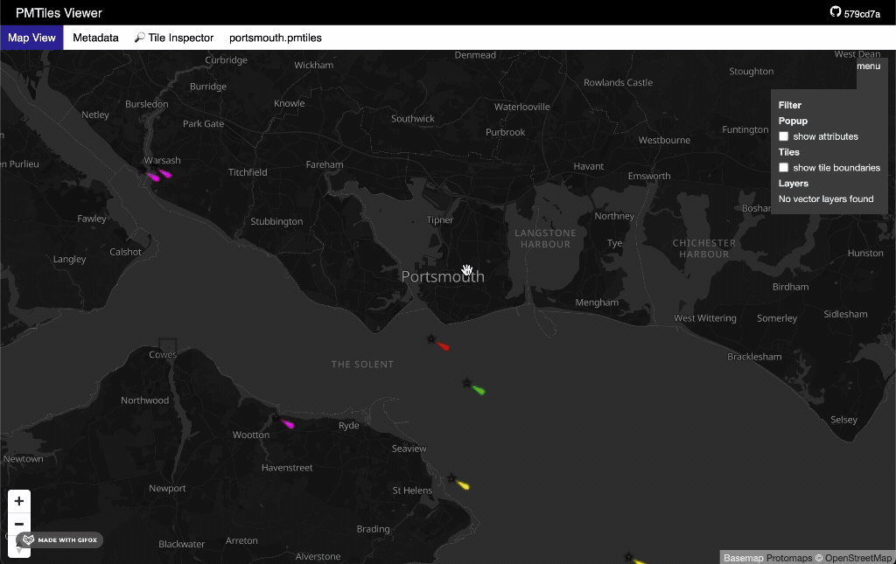

# tilepack

> Download tiles for offline use, camping, hiking, marine navigation, etc.

Take a XYZ tile URL and pack the tile images into a MBTiles file.



## Installation

1. Homebrew (macOS/Linux)
    ```bash
    brew tap eknowles/tools
    brew install tilepack
    ```
1. Download the latest release from the [releases page](https://github.com/eknowles/tilepack/releases) (Windows, macOS, Linux)
1. Build from source (Requires [Bun](https://bun.sh/))
    ```bash
    git clone git@github.com:eknowles/tilepack.git
    bun run build
    ```

## Example

Download tiles for a bounding box in Monaco and create a PMTiles file. Max zoom level is 17 (enough to see streets), concurrency is 20 requests at a time.

```shell
tilepack \
  --input "https://tile.openstreetmap.org/{z}/{x}/{y}.png" \
  --output monoco.mbtiles \
  --minzoom 0 \
  --maxzoom 17 \
  --bbox=7.3915,43.714,7.4613,43.7598 \
  --concurrency 20

pmtiles convert monoco.mbtiles monoco.pmtiles
```

<details>
  <summary>Duration 4.1s</summary>
  
  ```text
  Processing zoom level 0 (1 tiles)
  Processing zoom level 1 (1 tiles)
  Processing zoom level 2 (1 tiles)
  Processing zoom level 3 (1 tiles)
  Processing zoom level 4 (1 tiles)
  Processing zoom level 5 (1 tiles)
  Processing zoom level 6 (1 tiles)
  Processing zoom level 7 (1 tiles)
  Processing zoom level 8 (1 tiles)
  Processing zoom level 9 (1 tiles)
  Processing zoom level 10 (1 tiles)
  Processing zoom level 11 (1 tiles)
  Processing zoom level 12 (1 tiles)
  Processing zoom level 13 (4 tiles)
  Processing zoom level 14 (16 tiles)
  Processing zoom level 15 (56 tiles)
  Processing zoom level 16 (182 tiles)
  Processing zoom level 17 (624 tiles)
  Finished processing all zoom levels
  2024/08/18 09:02:45 convert.go:265: Pass 1: Assembling TileID set
  2024/08/18 09:02:45 convert.go:296: Pass 2: writing tiles
  100% |████████████████████████████████████████████████████████████████████████████████████████████████████████████████████████████████████████████████████████████████████████████████████████████████████████████████████| (895/895, 42014 it/s)
  2024/08/18 09:02:45 convert.go:350: # of addressed tiles:  895
  2024/08/18 09:02:45 convert.go:351: # of tile entries (after RLE):  647
  2024/08/18 09:02:45 convert.go:352: # of tile contents:  581
  2024/08/18 09:02:45 convert.go:374: Total dir bytes:  1945
  2024/08/18 09:02:45 convert.go:375: Average bytes per addressed tile: 2.17
  2024/08/18 09:02:45 convert.go:345: Finished in  24.71ms
  ```
</details>


## Usage

```bash
tilepack -i <input_url> [options]
```

## Options

- `-i, --input <input_url>` (required):
  The base URL for the XYZ tiles.

- `-o, --output <output_file>` (default: `output.mbtiles`):
  The path where the MBTiles file will be saved.

- `--minzoom <min_zoom>`:
  The minimum zoom level to fetch tiles.

- `--maxzoom <max_zoom>`:
  The maximum zoom level to fetch tiles.

- `--bbox <bounding_box>`:
  The bounding box for the tile fetching in the
  format `minLon,minLat,maxLon,maxLat`.

- `--header <header>` (can be used multiple times):
  HTTP headers to include in tile requests. Use this option for each header.

- `--token <api_token>`:
  An API token for authenticated requests. Used in `input` URL.

- `--retry <retry_count>` (default: `0`):
  The number of retry attempts for failed requests.

- `--format <image_format>` (default: `png`):
  The format of the tiles (e.g., `png`, `jpeg`).

- `--concurrency <concurrent_requests>` (default: `15`):
  The number of concurrent requests to fetch tiles.

## Example

Bounding box can be created using https://norbertrenner.de/osm/bbox.html

## Converting to PMTiles

Once the MBTiles file is generated, you can convert it to a PMTiles.

```shell
pmtiles convert example.mbtiles example.pmtiles
```

## Where to find map tile servers

You can find many tile servers tile services online, such as OSM, ArcGIS, Mapbox.

A [google dork](https://en.wikipedia.org/wiki/Google_hacking) will help you find many tile servers such as weather radar, satellite imagery etc.

Disclaimer: Do not download tiles from a tile server without permission, read the terms of service or license agreement.

## Contributing

Make an issue or PR if you have any suggestions or improvements.

## Alternatives

- https://portfolio.techmaven.net/apps/tile-utilities/
- https://offlinedatadownloader.techmaven.net/windows/
- https://github.com/mapbox/mbutil
- https://offlinedatadownloader.techmaven.net/
